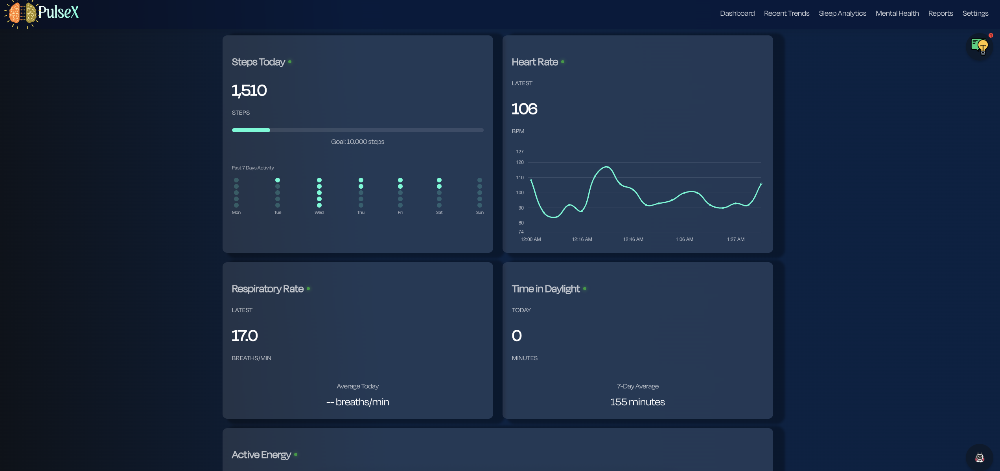
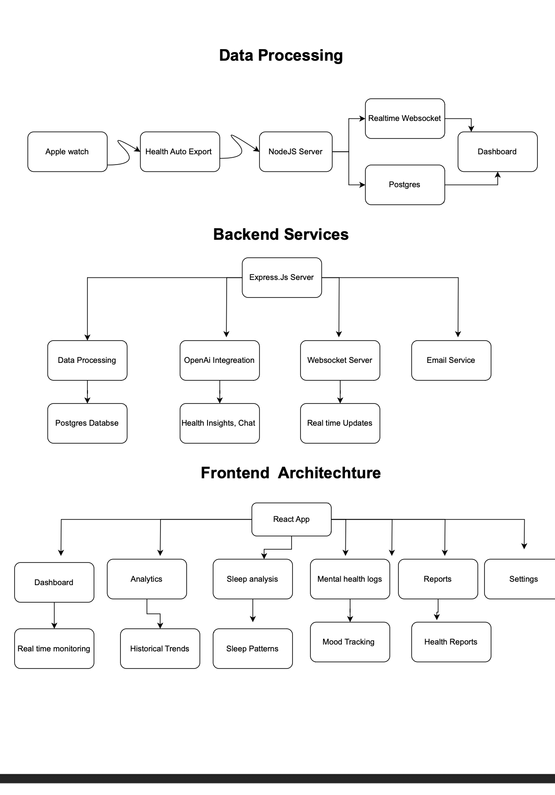

# PulseX

**PulseX** is a smart personal health assistant that ingests your smartwatch data, applies advanced analytics, and delivers in-depth, doctor-quality insights in real time. This project is currently under development and not hosted in production.

---


## Features

- **Real-time monitoring** of vitals: heart rate, step count, active energy, respiratory rate, sleep stages, and body temperature.  
- **Anomaly detection** with concise, punchy alerts highlighting significant deviations.  
- **Historical trend analysis** and daily summaries to track your health over time.  
- **Personalized recommendations** and friendly, therapist-like suggestions for mental well-being.  
- **Modular architecture** for easy extension with new metrics or visualization modules.

---

## API Integrations

HealthAI uses the following APIs and services:

- **Health Auto Export**: for automatic export of health metrics to JSON.  
- **Express.js**: RESTful API backend for ingesting and processing data.  
- **PostgreSQL**: database for storing and querying health metrics.  
- **OpenAI API**: to generate empathetic, actionable health insights and conversational prompts.

---

## Installation

1. **Clone the repository**:  
   ```bash
   git clone https://github.com/Shovan554/PulseX.git
   
2. **Install dependencies:**:  
   ```bash
    npm install



**## Usage

1. **Connect your Apple Watch** and enable the Health Auto Export app.  
2. **Run the backend server** (`npm start`).  
3. HealthAI will **ingest data** hourly, detect anomalies, and output alerts to the console.  
4. (Future) Connect a frontend or notification service for push alerts.

---

## Roadmap

- 🌐 **Web dashboard**: interactive charts and drill-down views.   
- 🔔 **Push notifications**: for critical alerts on anomalies.  
- 🔒 **Privacy controls**: user data encryption and fine-grained permissions.

---

## Contribution

Contributions are welcome! To get started:

1. Fork the repo.  
2. Create a feature branch (`git checkout -b feature/YourFeature`).  
3. Commit your changes (`git commit -m "Add feature"`).  
4. Push to the branch (`git push origin feature/YourFeature`).  
5. Open a Pull Request.

Please follow the existing coding style and commit guidelines.  
